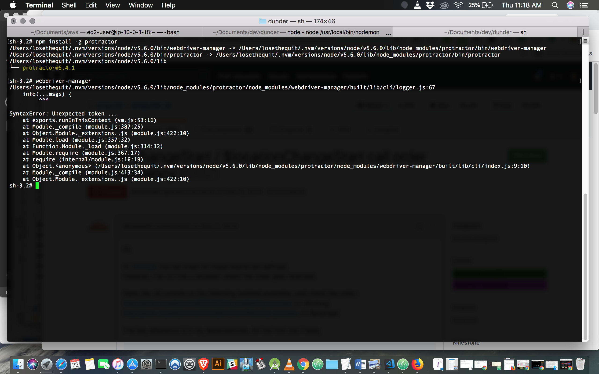

# DUNDER MIFFLIN

##### code test

#### Setup:

### npm install

### bower install

I decided to upload any dependencies to avoid any issues.

You can see a live preview here:
https://dunder-mifflin-code-test.herokuapp.com/

#### Issues:

I tried to install Protractor on my system but I couldn't get it working.
Everything else should work as planned.

I know that by not having this working, it may disqualify me. I'll try to get it up on c9.io
